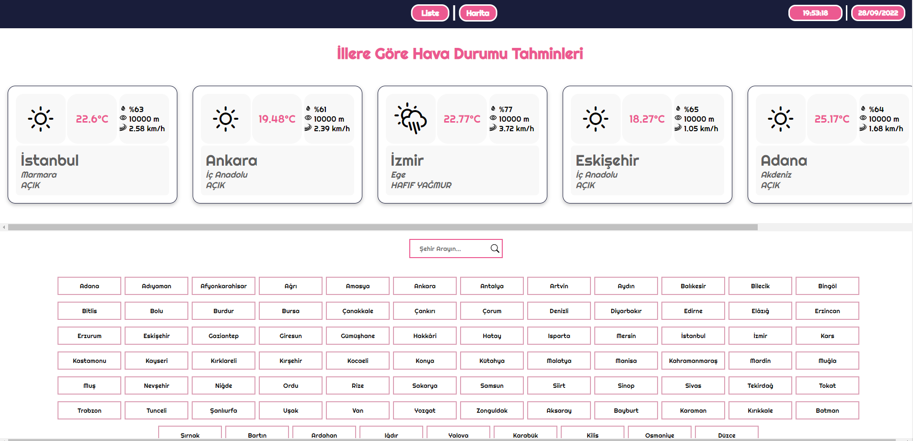
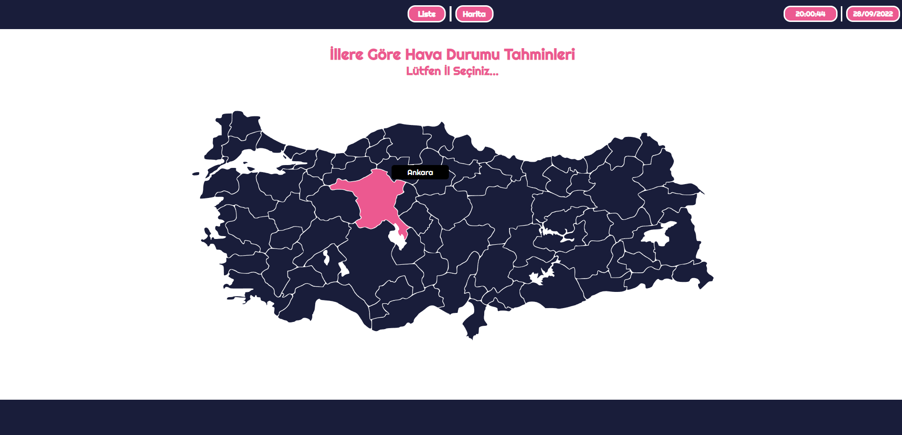
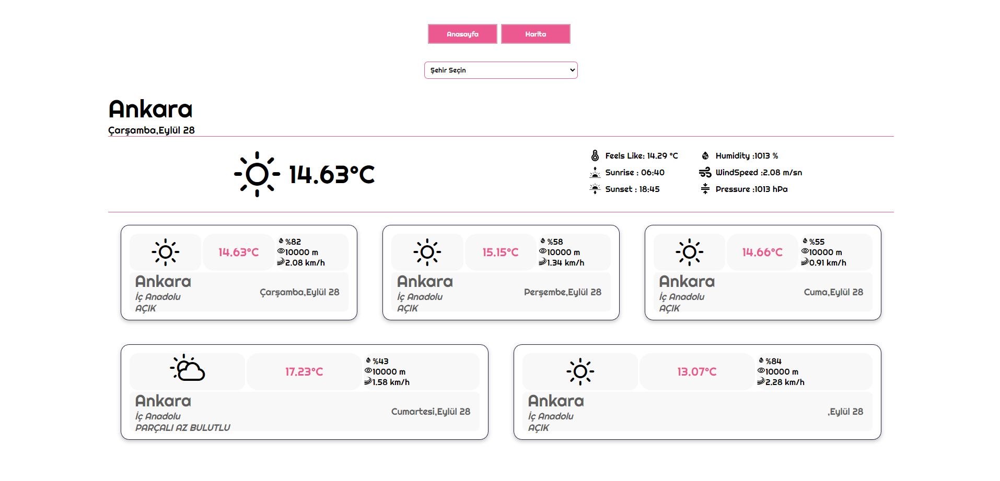

# Weather App

🔸 You can see weather condition of cities of Turkey. <br>
🔸 This web app built with using [React](https://reactjs.org/). <br>

## 💻 Setup <br>

### Install Dependencies

```
npm install
```

### Run the App in the Dev Server

```
npm start
```

### to Build for Production

```
npm build
```

## 🔥 Technologies and Libraries <br>

✔️ React.js <br>
✔️ react-router-dom <br>
✔️ axios <br>
✔️ redux <br>
✔️ redux-toolkit <br>
✔️ dayjs <br>
✔️ metarial-ui <br>
✔️ react-icons <br>
✔️ weather-react-icons <br>
✔️ turkey-map-react <br>
✔️ react-live-clock <br>

## 🚀 App Features <br>

✔️ User can see weather forecast of city of Turkey <br>
✔️ When selecting the city user can use Turkey map, list or search field. <br>
✔️ User can see for 5 days of forecast. <br>
✔️ The weather condition added based that every day's 15:00 o'clock. <br>
✔️ According to the current and daily weather condition information about weather is present to user. <br>

## 📷 Screenshot <hr>


<br>
<br>

<br>
<br>

